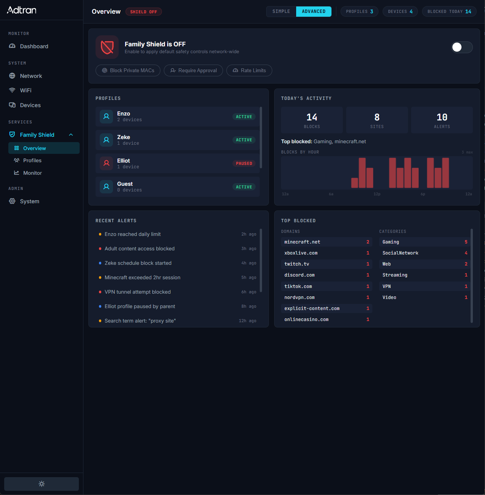
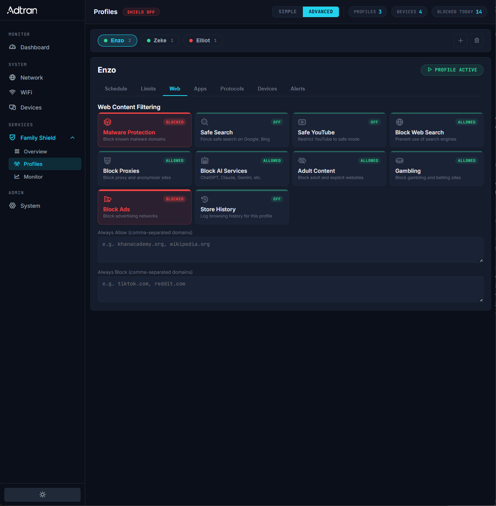
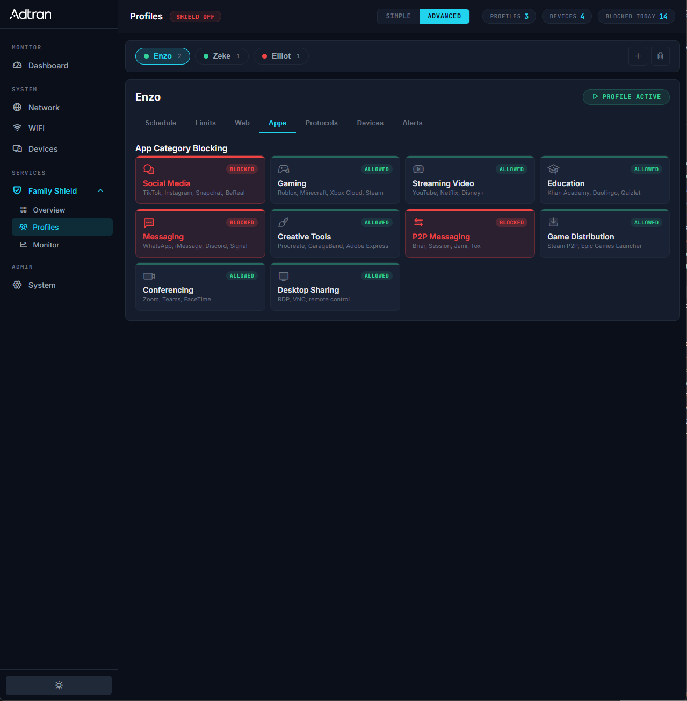
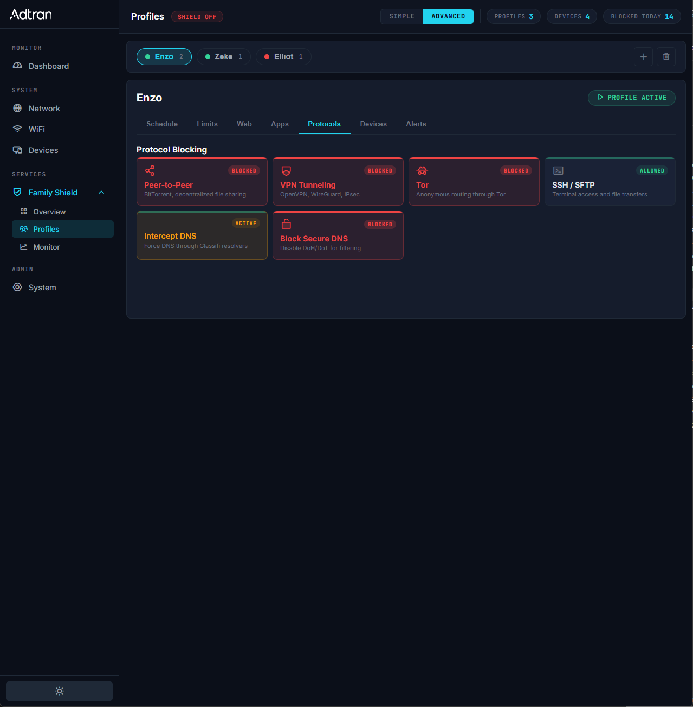
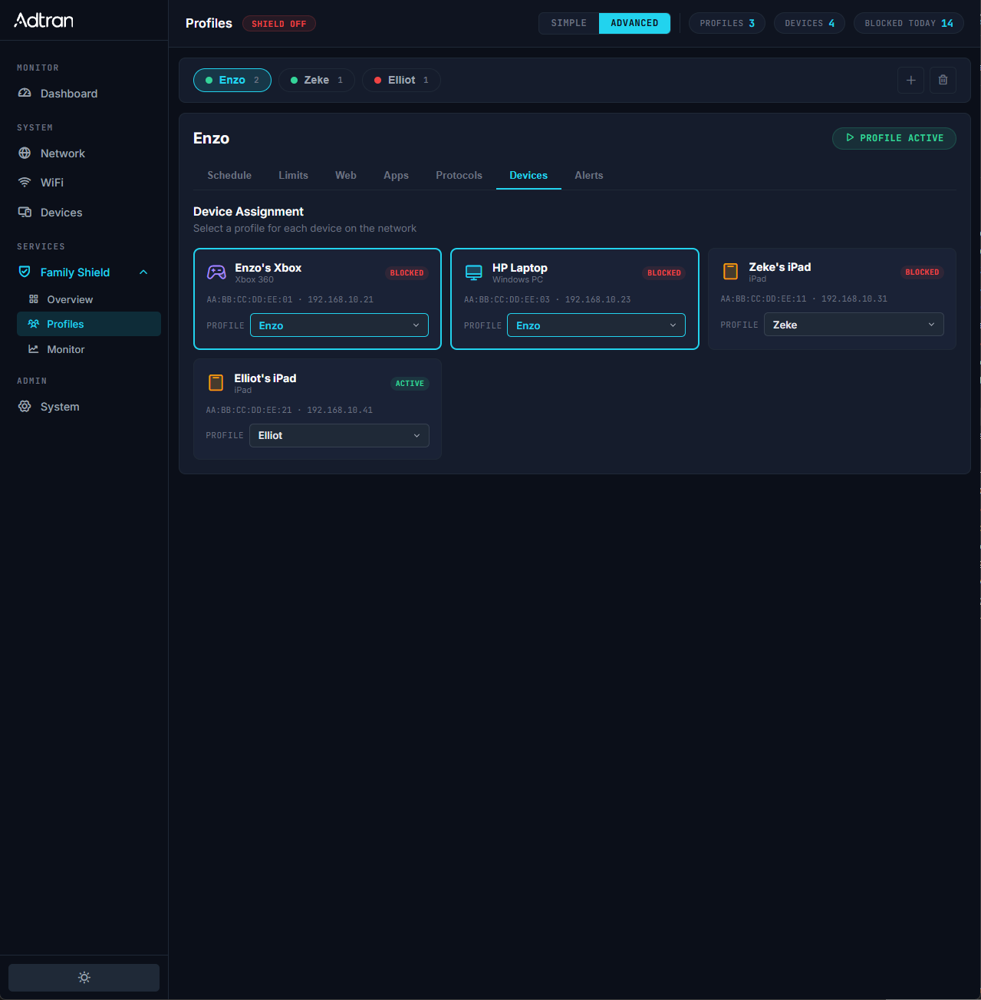
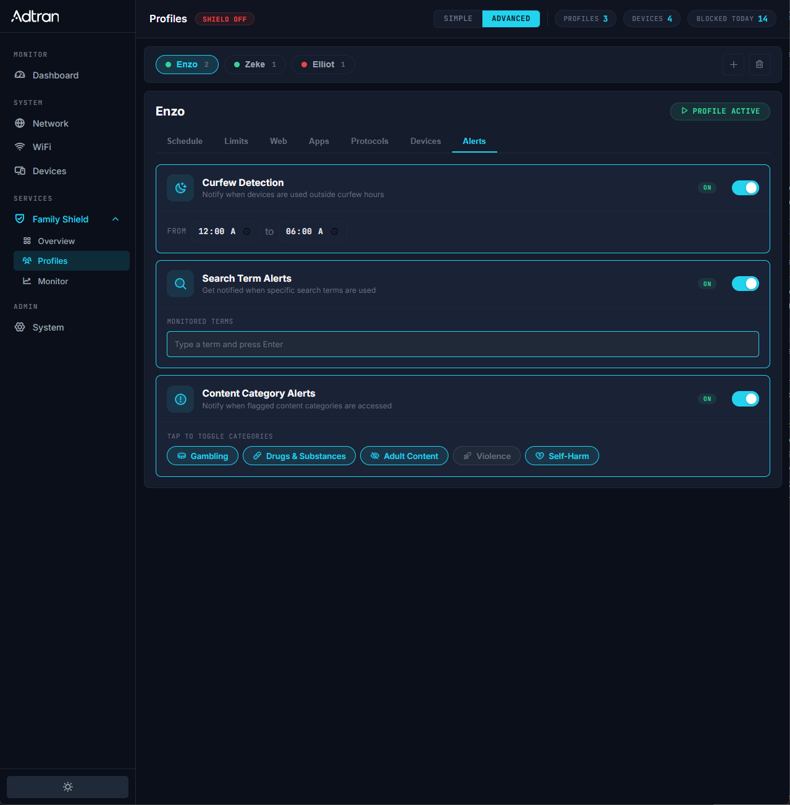
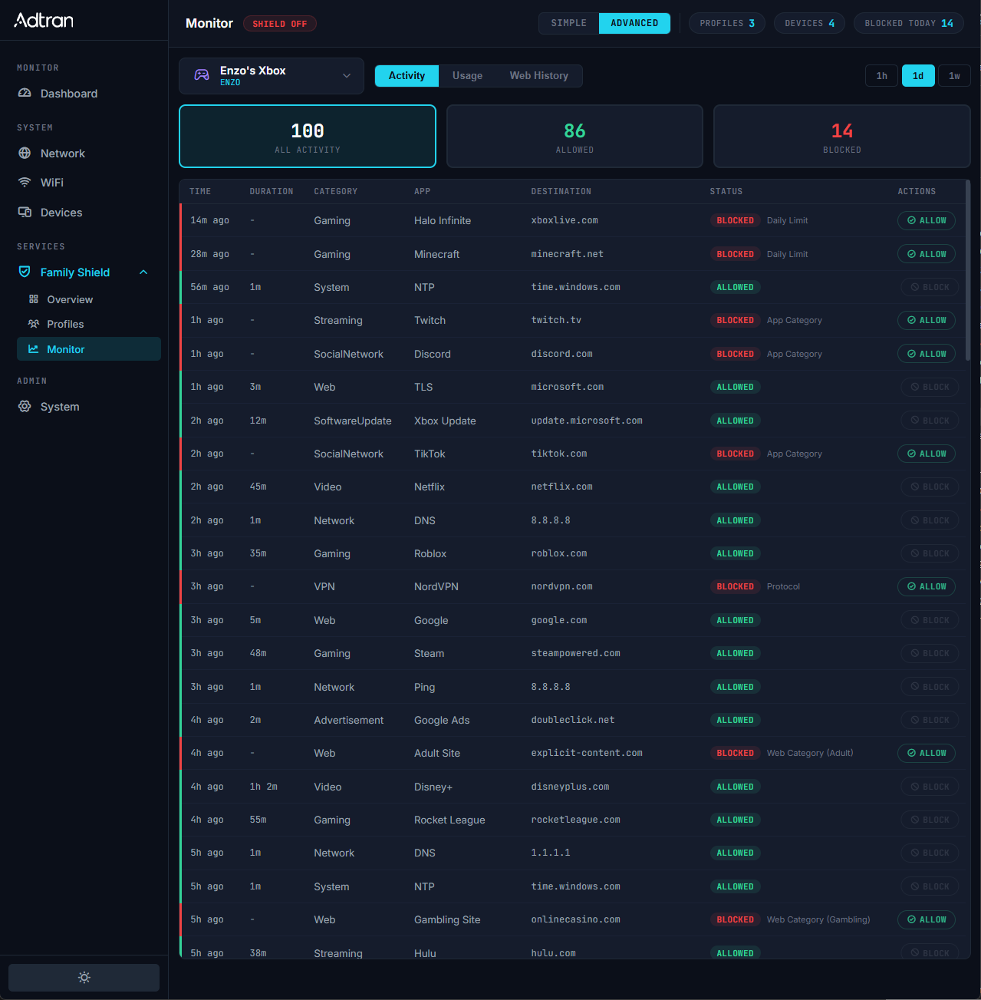
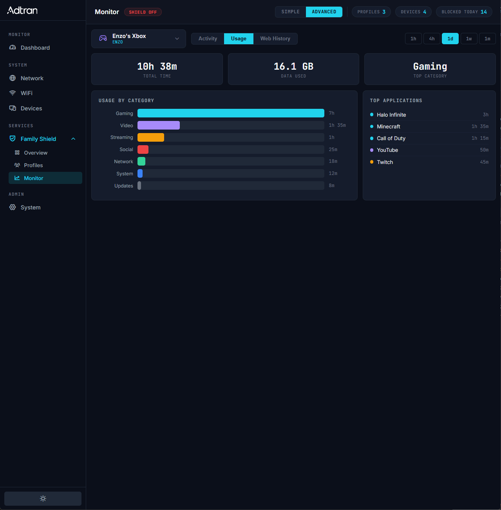
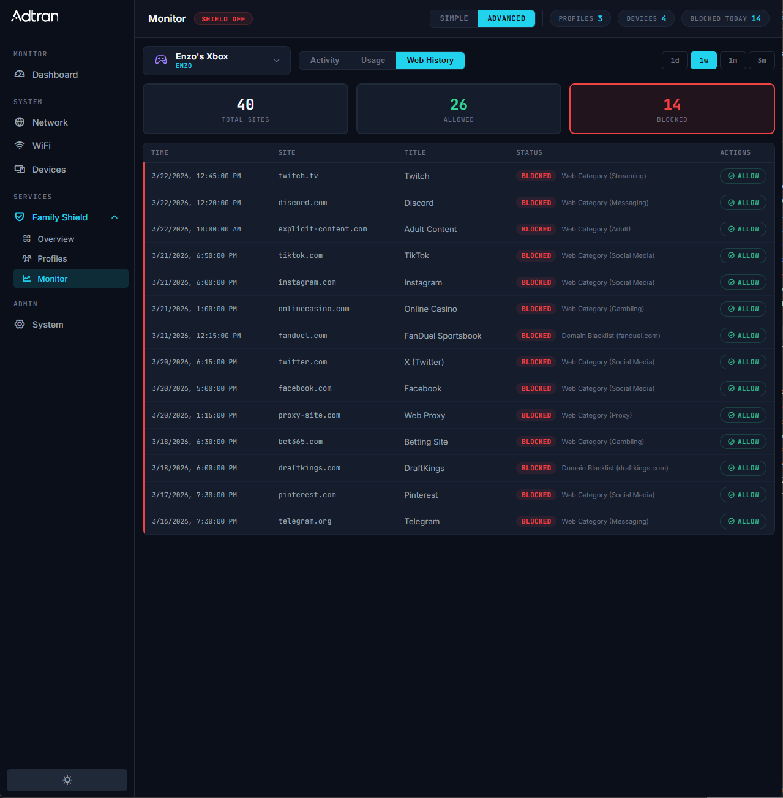

# FamilyShield WebUI

Parental controls interface for the SmartOS router platform. Vanilla JS/CSS/HTML prototype with no build tools or framework dependencies.

## Screenshots

### Overview Dashboard


### Profiles: Web Content Filtering


### Profiles: App Category Blocking


### Profiles: Protocol Blocking


### Profiles: Device Assignment


### Profiles: Alerts Configuration


### Monitor: Activity


### Monitor: Usage


### Monitor: Web History


## Architecture

```
index.html             Single-page shell with sidebar navigation
styles.css             SmartOS design system (CSS custom properties, dark/light themes)
familyshield.js        Application logic, view rendering, state management
familyshield-data.js   Data abstraction layer (mock fetch, swappable for $rpc calls)
mock/                  JSON fixtures for profiles, devices, activity, usage, web history
```

### Data Layer

`familyshield-data.js` exposes an `FS_DATA` module with Promise-based functions. Each function has a production RPC call noted in comments:

| Function | Production RPC |
|---|---|
| `getProfiles()` | `$rpc.juci.familyshield.profiles.list()` |
| `getDevices()` | `$rpc.juci.familyshield.devices.list()` |
| `getActivity(mac, minutes)` | `$rpc.juci.familyshield.activity.get()` |
| `getUsage(mac, range)` | `$rpc.juci.familyshield.usage.get()` |
| `getWebHistory(mac, days)` | `$rpc.juci.familyshield.webhistory.get()` |
| `blockDevice(mac, duration)` | `$rpc.juci.familyshield.devices.block()` |
| `getGlobalSettings()` | `$rpc.juci.familyshield.settings.get()` |

### Design System

Built on SmartOS WebUI conventions:
- **Fonts:** JetBrains Mono (labels, data), Inter (body)
- **Themes:** Dark and light via CSS custom properties
- **Colors:** Cyan accent, red/green status, muted borders
- **Components:** Cards, stat badges, chip toggles, filter pills, status badges, tables with hover-reveal actions

## Running Locally

Serve the directory with any static file server:

```bash
# Python
python -m http.server 3000

# Bun
bunx serve -p 3000

# Node
npx serve -p 3000
```

Open `http://localhost:3000` in a browser.

## Features

- **Overview:** Shield status with chip toggles, profile summary, activity stats with clickable badges, blocks-by-hour chart with tooltip, recent alerts, top blocked domains/categories
- **Profiles:** Age-group presets (Elementary through Adult), web content filtering, app category blocking, protocol blocking, schedule/curfew, device assignment, search term and category alerts
- **Monitor:** Activity table with All/Allowed/Blocked filter chips, usage breakdown by category with bar chart and top apps, web history with status filtering and time range selection
- **Cross-view navigation:** Dashboard badges link directly to filtered Monitor views
- **Inline actions:** Block/Allow pill buttons on table rows with in-place status updates
